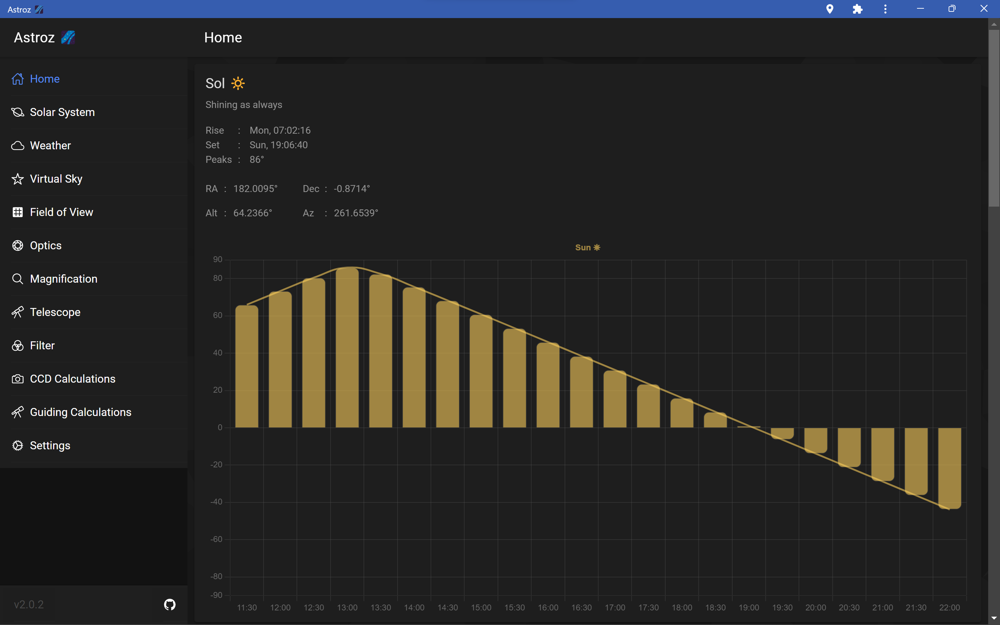
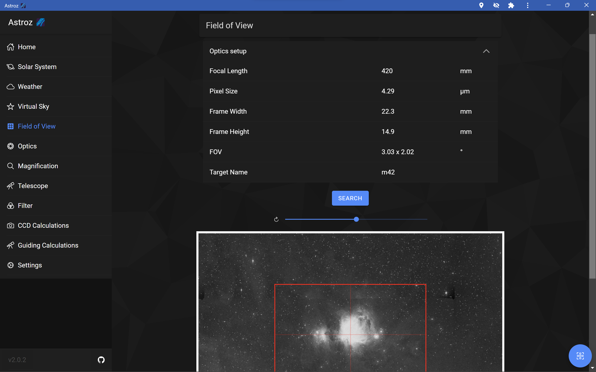
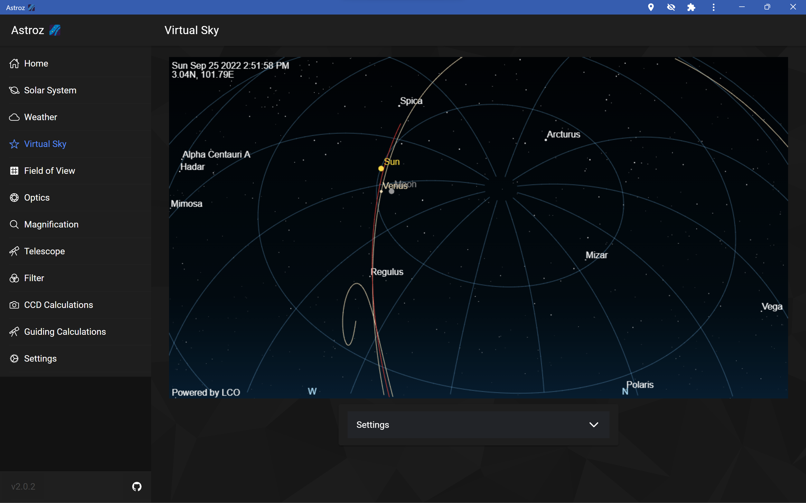
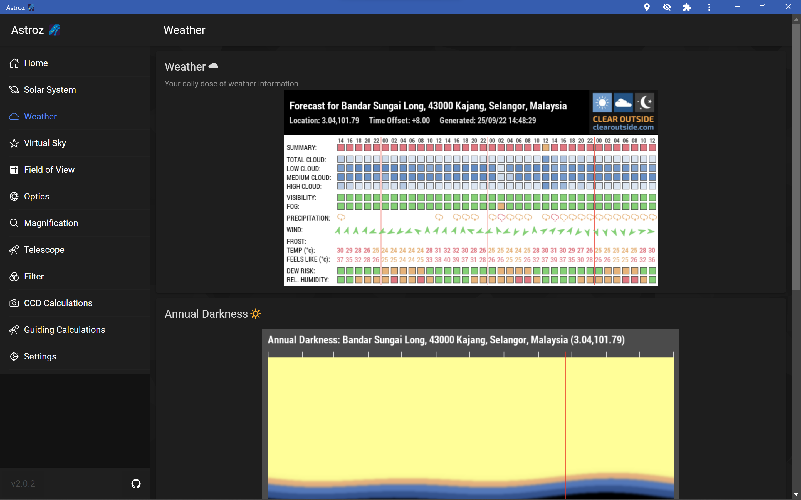
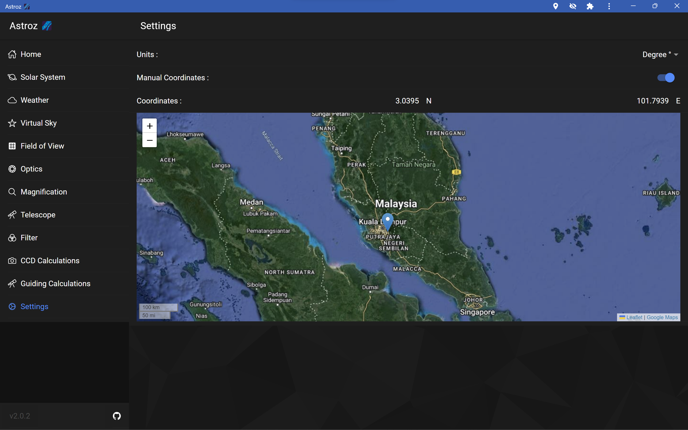

# Astroz 🌌

## A general astrophotography focused application

 

## Contains useful calculators for astrophotography and general visual astronomy
### Formulas provided by [Astronomy.tools](https://astronomy.tools/)

## Weather Forecast
### Provided by [ClearOutside](https://clearoutside.com)

 

## Manual Location with Google Maps

## Astroz 🌌 is installable as PWA on Desktop, iOS and Android!
